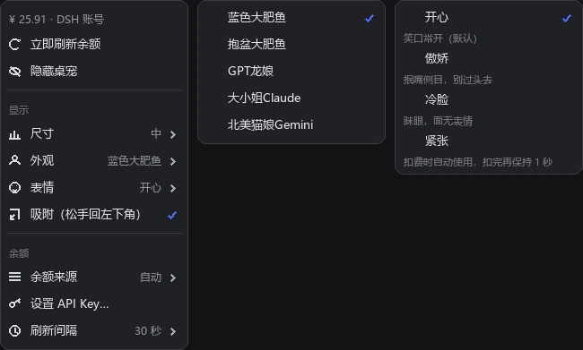
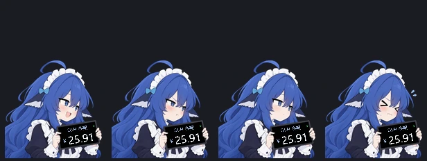
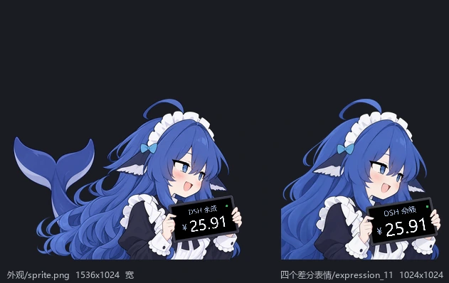
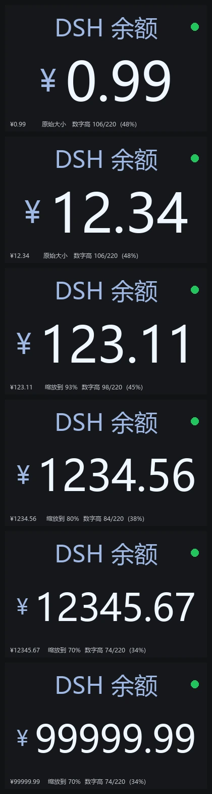

# dsh-plugin-balance-pet

A **balance pet for DeepSeek Harness**: a frame-wide companion inside the Harness Web
UI that watches your balance. Every cent spent plays a red flash, a shake and a floating
`-0.01`; a top-up shows immediately with the credited amount.

Ported from [VKmich16/VK-1](https://github.com/VKmich16/VK-1) — the macOS
`dsh-balance-pet-macos` 1.3.1 for the four appearances and the offline pose, and the
**D-16BVM "DSH余额挂件现代化改进型"** for the four differential expressions. **Not** a
standalone application: there is no `.app`, no tray icon, no desktop window and no second
process.

**0.3.1** is a maintenance release: dead code removed, one fake doctor check replaced with a
real one, and the artwork resolved once per frame instead of twice. No behaviour change.
**0.3.0** added the 抱盆大肥鱼 appearance, the 1-second hold on the 紧张 face, and hiding /
restoring the pet. **0.2.0** moved the whole settings surface onto the pet's right-click
menu (there is no Settings page any more) and split the artwork into two axes: **外观**
(five characters) and **表情** (four differential expressions).

## The right-click menu is the settings

Right-click the pet (or Control-click). Everything is there:



| Entry | What it does |
|---|---|
| **status line** | The current reading and where it came from, e.g. `¥ 25.91 · DSH 账号`, or the reason it is offline. |
| **立即刷新余额** | Forces one upstream query now, skipping the interval and the failure backoff. |
| **隐藏桌宠** | Hides the pet and hands the toggle over to the sidebar foot. Only offered while that entry is available. |
| **显示** | group heading |
| ↳ **尺寸** | 小 110 / 中 150 / 大 210 / **自定义…** (60–420 px, typed into a small dialog). The old 特大 preset is gone; 自定义 replaces it. |
| ↳ **外观** | The five characters: 蓝色大肥鱼 / 抱盆大肥鱼 / GPT龙娘 / 大小姐Claude / 北美猫娘Gemini. |
| ↳ **表情** | The four 差分表情 (differential expressions): 开心 / 傲娇 / 冷脸 / 紧张. Enabled only for 蓝色大肥鱼, which is the only character with differential art. |
| ↳ **吸附** | A toggle. On (default): releasing the pet in 0.16 s snaps it to the bottom-left corner. Switching it on also moves the pet there immediately. Off: it stays where you drop it. |
| **余额** | group heading |
| ↳ **余额来源** | 自动 / 仅 DSH 账号 / 仅 API Key — see below. |
| **设置 API Key…** | Stores a key inside a small dialog (see below). |
| **清除已保存的 Key** | Appears only when a key is stored. |
| ↳ **刷新间隔** | 10 秒 / 30 秒 / 1 分钟 / 5 分钟. The real floor and ceiling (10–300 s) are enforced by the Host. |

The menu is a normal grouped menu: dim non-interactive group headers, icons, a `›`
chevron on submenus, a ✓ on the selected choice, and a right-floating value so the
current setting is visible without opening the submenu. Escape or any click outside
closes it.

## Hiding the pet, and getting it back

The two controls are **mutually exclusive** — at any moment exactly one of them exists:

| State | What is on screen |
|---|---|
| Pet shown | The pet, and **隐藏桌宠** inside its right-click menu (directly under 立即刷新余额). The sidebar foot shows nothing. |
| Pet hidden | Nothing where the pet was. A **DSH 余额桌宠** entry appears beside Settings at the sidebar foot; clicking it brings the pet back. |

So there is no floating "show" button to sit on top of your account row, and no sidebar
entry taking up room while the pet is already on screen.

Two consequences worth knowing:

- The sidebar entry is the **only** way back, so is a hidden pet a dead end if that slot
  ever stops resolving? No: the entry announces that it mounted (`pet.sidebarReady`), and
  the menu's **隐藏桌宠** stays **disabled** — with a one-line explanation — until it has.
  A DSH build with a broken sidebar slot therefore cannot strand the pet.
- Hiding is a saved preference, so it survives a page reload. If you ever need to undo it
  without the entry (for example after switching to an incompatible DSH), clear it in the
  browser console:

  ```js
  var k = 'dsh-plugin-balance-pet/preferences'
  var p = JSON.parse(localStorage.getItem(k) || '{}')
  p.hidden = false
  localStorage.setItem(k, JSON.stringify(p))
  location.reload()
  ```

## 外观 vs 表情

They are two independent axes:

| Axis | Choices | Notes |
|---|---|---|
| **外观** | **5** characters | 蓝色大肥鱼 (the default) is served by the differential set below; 抱盆大肥鱼, GPT龙娘, 大小姐Claude and 北美猫娘Gemini are single 1536 × 1024 images, each with its own measured tablet corners. |
| **表情** | 4 moods of 蓝色大肥鱼 | 开心（默认）/ 傲娇 / 冷脸 / 紧张 — the D-16BVM `expression_11/12/21/22` art (1024 × 1024). |



**The expression is not only decorative:**

| State | Face |
|---|---|
| Money is draining (`pendingSteps > 0` or a hit is playing) | **紧张** — automatically, whatever resting face you chose |
| The last cent has landed | **紧张** stays on for **1 more second**, then relaxes |
| A top-up just landed (0.9 s) | **开心** |
| Everything else | the face you chose in 表情 |

So a run of deductions shows her wincing the whole time, holding the wince for a beat after
the money stops moving, and only then relaxing; a recharge gets a smile. Pick 傲娇 as the
resting face and a drop still shows 紧张 — that is the point of having four.

### 抱盆大肥鱼, and the automatic offline pose

**抱盆大肥鱼** is the pose holding a basin. It has no tablet, so choosing it shows the
character with **no balance title, amount, status dot or floating amounts** — a "just the
pet" mode.

The same pose is also what **蓝色大肥鱼** falls back to automatically whenever there is no
reading at all: no DSH account, no API key, still connecting, or a failed query. As soon as
a reading succeeds she returns to the tablet with the balance on it. The other three
appearances keep their tablet and show `--` instead, exactly as the desktop original does.

## Two framings: 宽构图 vs the current one

You asked what "宽构图" means. Both are the same character; the difference is how much of
her is in the picture, and therefore how big the tablet — hence the balance — is:



| | `外观/sprite.png` (宽构图) | the differential set (current) |
|---|---|---|
| Source | macOS `dsh-balance-pet-macos` 1.3.1 | D-16BVM `expression_11…22` |
| Image | 1536 × 1024 (3:2) | 1024 × 1024 (1:1) |
| Framing | Wide: the whole character, whale tail included on the left | Closer crop: head, shoulders and a large tablet |
| Pet box at 中 (150 pt) | 225 × 233 | 155 × 233 |
| Balance on the tablet | Small — the tablet is ~49 pt wide | Much bigger and comfortable to read |

**蓝色大肥鱼 now uses the differential set**, because that is where the four 表情 live:
all four images share one framing, so switching mood never makes her jump, and the bigger
tablet makes the readout legible at every size preset. That is why `外观/sprite.png` is
verified by `tools/make-assets.py` but not shipped.

The cost is the wide composition — no whale tail, and a narrower box. If you would rather
have the wide framing as 蓝色大肥鱼's resting look, say so: the honest way to do it is to
give up the 表情 axis for that appearance (one image, no differential switching), because
mixing the two framings would make every mood change look like a jump cut.

## Behaviour

| Situation | What happens |
|---|---|
| Balance drops by N cents (N ≤ 400) | One step per cent, one step every **0.2 s**: red flash, shake, and a red `-0.01` floating up and fading over 0.95 s — with the **紧张** face on throughout and for one second after. |
| Balance drops by more than 400 cents | The display **aligns** to the new balance instead of playing minutes of queued animation. |
| A poll repeats the same balance | Nothing replays: the pending count is re-derived from the lagging display, so already-animated cents are never animated twice. |
| Balance goes up | The new balance shows **immediately**, a green ring pulses for 0.9 s, and the credited amount floats up — computed from the **two consecutive server readings**, not from the lagging display. |
| A page reloads, or 余额来源 changes | The first reading aligns; there is nothing to animate *from*, and a difference between two different accounts must never be played as spending. |
| A tab is in the background, or a frame is long | Upstream traffic pauses, and one long frame can fire at most one step, so waking up never produces a burst. |
| No reading at all | 蓝色大肥鱼 shows the 抱盆大肥鱼 pose; the menu's status line says why. The other three keep their tablet with `--`. |
| The pet is grabbed on a transparent corner | The click reaches the app underneath — input is claimed only where the sprite has a pixel. |


**Deliberately removed** from the desktop original: the `hit.mp3` sound effect and its
toggle, and the *测试一次扣费* / *演示连续扣费* rehearsals with every animation they
drove. The drop animation now runs only when the Host reports a real balance change. The
test suite asserts neither can come back.

## Where the balance comes from

| Source | How |
|---|---|
| **DSH 账号** | `ctx.get('deepseekAccount').getBalance(...)` — the same Host-only seam DSH's own account page uses. It owns the grant, the Platform origin, the `x-dsh-auth-token` header and the response envelope, so this plugin never touches your credentials and never sees a token. The reading is `value` + `bonusWallets`, CNY only; USD never masquerades as ¥. |
| **API Key（桌宠设置）** | A key you save from **设置 API Key…**, stored at `<dshHome>/balance-pet/apikey.txt` with mode 0600 (written to a temp file and renamed, so a failure leaves the old key intact). Queried against `https://api.deepseek.com/user/balance`. |
| **DEEPSEEK_API_KEY（~/.dsh/.credentials.yaml）** | The key DSH's own model settings write. Used when no key was saved in the pet. |

**余额来源 decides which one is used, because the right answer is not always obvious:**

| Choice | Behaviour |
|---|---|
| **自动** (default) | The DSH account first. If it is **signed out**, fall through to a key. If the account query genuinely **fails**, report that failure — do not quietly swap in a key's balance, because when a grant is stored the account balance *is* the balance and a silent swap would disagree with DSH's own account page. |
| **仅 DSH 账号** | Never uses a key. A signed-out account is reported as such. |
| **仅 API Key** | Never touches the account seam at all (asserted by a test and by the live verification script). |

That choice exists precisely because "I saved an API key and nothing changed" is the
confusing case: signed in with an account, the key is *not* the source unless you say so.

> **Why the key field is not redundant with DSH's own:** DSH keeps its key for *inference*
> under Settings → Models. The pet only needs a credential when it must read a **balance**,
> which is a different endpoint. Saving the key here means the pet keeps working when the
> account is not signed in, without touching DSH's credential file.

Money is never handled as a float: `decimalToCents` shifts the decimal point inside a
digit string and rounds half-up with `BigInt`, so `0.1 + 0.2` is exactly 30 cents. Every
key and token is validated as a single printable line before use, and the Host never
returns credential material to the page — only a `apiKeyStored: true/false` flag.

## How the two halves talk

The browser cannot reach `deepseekAccount` (Host-only), and this package ships no build
step for DSH's generated Remote artifacts, so the halves speak over ordinary HTTP routes
on `ctx.webServer`:

| Route | Purpose |
|---|---|
| `GET …/doctor` | Every seam's live verdict, the last reading, and the browser's self-report. |
| `GET …/state?interval=&source=&report=` | The current reading; also the browser's ≈1 Hz heartbeat and self-report. |
| `POST …/refresh` | Force one upstream query, bypassing the interval and the backoff. |
| `POST …/apikey` / `DELETE …/apikey` | Store or clear the pet's own key. |
| `GET …/asset?file=` | One artwork file, matched against a filename allowlist. |

Every JSON route requires the `x-dsh-plugin-balance-pet` request header: a cross-origin
page cannot set a custom header without a CORS preflight, and no route answers one. The
asset route is intentionally open — `` and CSS loads cannot set headers, and the
artwork is not a secret.

**No browser open ⇒ no upstream traffic at all.** The Host polls only when a page asks, at
most once per interval, at most one request in flight, with doubling backoff after
failures (capped at 5 minutes).

## Install

```
plugin_manager install_bundle  →  <path to this package>
```

or, equivalently:

```sh
dsh plugin --profile desktop add <path to this package>
```

**Restart DSH after installing or updating.** The Client half hot-reloads, but a plugin's
**Host half is not hot reloaded** — and any release that adds or renames artwork files will
leave the old Host answering the old filename allowlist while the new Client asks for the
new names. The pet looks broken (grey boxes) in that window. Confirm with
`GET /dsh-plugin-balance-pet/doctor`: `version` must read the version you installed.

## Installing

**From a release.** Each release carries two self-contained artifacts, both driven by the
manifest's `files` list:

| Artifact | Use |
|---|---|
| `dsh-plugin-balance-pet-<version>.zip` | Unzips to one folder — the simplest route. |
| `dsh-plugin-balance-pet-<version>.tgz` | An npm/pnpm tarball, if you prefer one file. |

Put the folder somewhere **permanent** first — DSH profiles record an **absolute** path, so
moving it later means reinstalling. Then:

```sh
# A) point the plugin manager (or `dsh plugin`) at the folder
dsh plugin --profile desktop add /path/to/dsh-plugin-balance-pet

# B) or install straight from the tarball
dsh plugin --profile desktop add /path/to/dsh-plugin-balance-pet-0.4.0.tgz
```

In a DSH session the same thing is one line: *"install*
`/path/to/dsh-plugin-balance-pet` *into the desktop profile with*
`plugin_manager install_bundle`*, *then show me its doctor route."*

**From a clone.** The repository root *is* the plugin, so clone it and install that folder:

```sh
git clone https://github.com/nepa77/dsh-plugin-balance-pet.git
dsh plugin --profile desktop add /path/to/dsh-plugin-balance-pet
```

Then **restart DSH** (see below). The package needs **no `npm install` and no build step**:
the artwork ships inside it, the browser half is a hand-written bundle, and the only thing it
writes at runtime is the optional API key at `<dshHome>/balance-pet/apikey.txt`.

## How long a balance fits on the tablet

The readout auto-shrinks rather than clipping: `drawTablet` measures `"¥ " + amount` at the
full sizes, then scales **both** down by `min(1, panelWidth × 0.9 ÷ measured)`.



| Balance | Shrink | Digit height (of the 220-unit panel) |
|---|---|---|
| `¥0.99` | none | 106 (48 %) |
| `¥12.34` | none | 106 (48 %) |
| **`¥123.11`** | **93 %** | **98 (45 %)** |
| `¥1234.56` | 80 % | 84 (38 %) |
| `¥12345.67` | 70 % | 74 (34 %) |
| `¥99999.99` | 70 % | 74 (34 %) |

**So yes — `123.11` displays fine.** It is 93 % of the full size, which is visually
indistinguishable from `12.34`, and the full seven digits are inside the screen. Even
`99999.99` stays complete and legible. Nothing is ever clipped: it trades size for
completeness, which is the behaviour the desktop original shipped too.

## Licence

The **plugin code** in this repository is MIT — see [LICENSE](LICENSE).

The **character artwork** under `assets/` is not mine and is not covered by that licence.
It is third-party work, redistributed unmodified (apart from downscaling) with attribution
to [VKmich16/VK-1](https://github.com/VKmich16/VK-1) and
[@Andromedahk](https://github.com/Andromedahk). Their terms, the exact upstream path and git
blob id of every image, and how to re-verify the copies are all in
[THIRD-PARTY-NOTICES.md](THIRD-PARTY-NOTICES.md). Please read it before reusing the images
yourself.

## Versioning

`MAJOR.MINOR.PATCH`, and both halves must agree — `VERSION` in `src/index.js` and `version`
in `package.json` — which a test enforces (`doctor.version` is compared against the manifest,
not against a hard-coded string, so a bump cannot silently break the suite).

| Change | Bump |
|---|---|
| A fix, a cleanup, a docs-only change | PATCH (`0.4.1`) |
| A new menu entry, a new setting, new artwork | MINOR (`0.5.0`) |
| A change to what the plugin *does* that a user must know about | MINOR, with a README section |

After bumping, re-run the suite (`node test/balance-pet.test.mjs`) and, in the development
workspace, re-pack with `python tools/pack-plugin.py` — which extracts the tarball it just
wrote, syntax-checks both halves, and runs the bundled suite from the extracted copy. A
package that cannot check itself is not worth shipping; that check is exactly how a
forgotten version-bump in a test was caught during 0.3.1.

## Verify

```sh
# 1. offline: money math, source modes, the animation model, geometry, routes, scope guards
node packages/dsh-plugin-balance-pet/test/balance-pet.test.mjs

# 2. offline: what the pet and its menu look like, using the browser's own drawing math
python tools/render-pet-preview.py            # pet + a menu mock
python tools/render-pet-preview.py --corners  # tablet-corner overlays on every artwork

# 3. live: seams, version freshness, guards, a real balance query, both source modes
powershell -NoProfile -ExecutionPolicy Bypass -File tools\verify-live.ps1
```

The live script's first check compares the running Host's `version` against
`package.json` and tells you to restart when they differ — that is the one failure that
makes everything after it meaningless.

## Layout

```
package.json            dsh.bundle.patch + dsh.client(platform web, immediately) + icon + meta
cordis.patch.yml        the one profile row this bundle inserts
icon.svg                the plugin-manager card icon
locale/{zh,en}.json     display title and description
src/index.js            Host half: the account seam, the key store, scheduling, the HTTP face, doctor()
src/client.js           Client half: the pet canvas, the animation model, the menu, the dialogs, the sidebar entry
assets/                 8 images, ~1.1 MB: 4 expressions (768²) + 4 appearances (1152×768)
test/balance-pet.test.mjs   80 zero-dependency assertions
skill/dsh-plugin-balance-pet/SKILL.md   the re-adaptation runbook
compat/expected-surface.json  the recorded dependency surface
docs/previews/          the rendered previews used above
```

## Notes and limits

- The artwork is derived from `VKmich16/VK-1`, from the folder you supplied
  (`五个外观和差分表情/`). All **9** files in it were verified **byte-identical** to GitHub
  `HEAD` by git blob SHA-1 before use (`tools/make-assets.py`), as was `hit.mp3` from the
  macOS bundle — verified and then deliberately **not** shipped.
- `外观/sprite.png` (the wide framing) is verified but not shipped; see the framing section
  above for why, and say the word if you want it back.
- The D-16BVM art is 1024 × 1024, so 蓝色大肥鱼 gets a narrower, taller box than the
  1536 × 1024 characters. The layout follows each artwork's own aspect ratio rather than
  stretching it.
- The tablet quad is measured per artwork: the D-16BVM numbers are that project's own
  sprite constants, the wide ones are the macOS build's. `--corners` re-checks them.
- The pet lives in the page, so it scrolls and scales with the Harness window rather than
  floating over the OS desktop. That is the consequence of "a DSH plugin, not a standalone
  app".
- At 小 / 中 the tablet readout is small in the *wide* artworks; 蓝色大肥鱼's 1024² art
  has a much larger tablet, so its readout is legible even at 中.
- There is no 退出 entry: a plugin cannot quit DSH.
- `src/client.js` requires exactly one platform module, `react`. A test fails if that
  ever grows.

MIT. Artwork and the original designs are from
[VKmich16/VK-1](https://github.com/VKmich16/VK-1).
